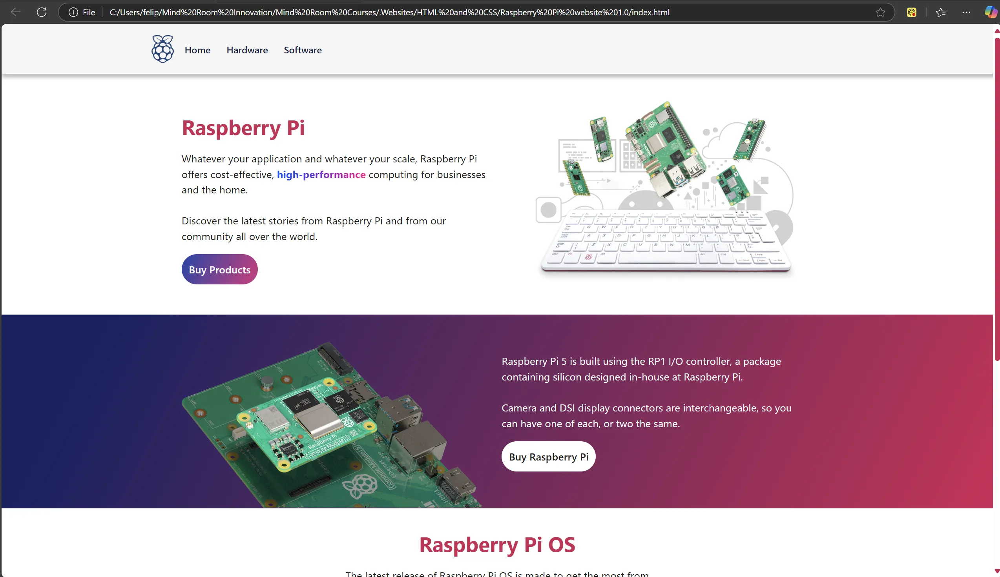
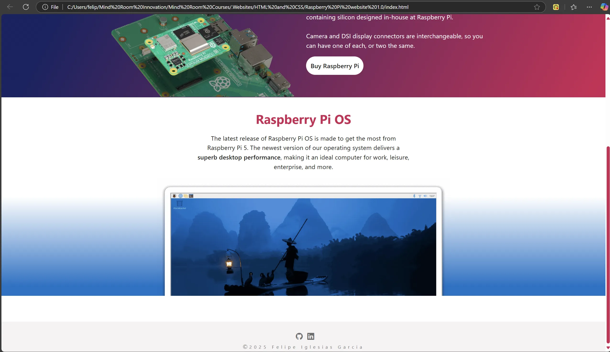
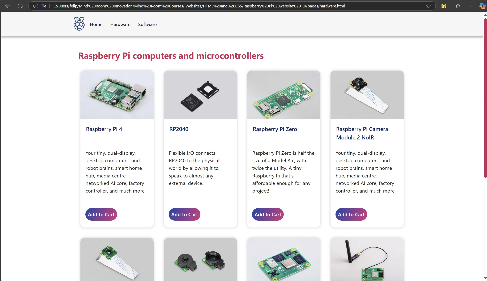

## 📄 Description

🍓In this project, I re-imagined the UI/UX of the Raspberry Pi official website using HTML and CSS.

* 🚫🏗️No frameworks
* 🚫🤖 No AI code 
* 📁 Local content

The website is optimized for a 16" 2560x1600 display with a 16:10 aspect ratio.

## 📷 Screenshots

### index.html

  

